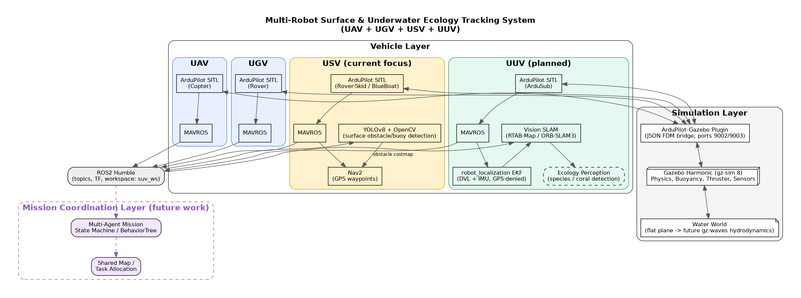

# UAV-UGV-USV-UUV Multi-Robot Environmental Monitoring Platform

A simulation-first multi-robot robotics platform integrating **UAV, UGV, USV, and UUV** systems for autonomous environmental and underwater ecology monitoring.



## Overview

This project began as a hybrid surface/underwater autonomous vehicle (USV/UUV) and has grown into a broader multi-robot platform: a fleet of aerial, ground, surface, and underwater vehicles working together for environmental and ecological monitoring — aerial survey and relay (UAV), shore operations (UGV), surface transit and communication bridging (USV), and underwater sensing (UUV).

It is built entirely in simulation on Gazebo Harmonic + ArduPilot SITL + ROS2 Humble, with a development path toward real hardware.

## Tech Stack

- **Simulation:** Gazebo Harmonic (gz-sim 8), ArduPilot official Gazebo plugin (JSON FDM bridge)
- **Autopilot:** ArduPilot SITL (Copter / Rover / Rover-Skid / ArduSub frames)
- **Middleware:** ROS2 Humble, MAVROS
- **Navigation:** Nav2, `robot_localization` (EKF for GPS-denied underwater navigation)
- **Perception:** YOLOv8, OpenCV, vision SLAM (RTAB-Map / ORB-SLAM3) for underwater mapping
- **Reference vehicle model:** ArduPilot's official BlueBoat (SITL_Models) for the USV

## Status — What's Done So Far

- ROS2 workspace (`suv_ws`) with four packages: bringup, description, perception, navigation
- ArduPilot Rover SITL built from source and verified running standalone
- Migrated from Gazebo Classic to Gazebo Harmonic after confirming the official ArduPilot Gazebo plugin no longer supports Classic; rebuilt the full toolchain and dependency set for Harmonic
- Fixed VM-specific rendering issues (forced software rendering to resolve a black-viewport bug under VirtualBox)
- **Validated the full simulation pipeline end-to-end** using ArduPilot's reference quad-copter model: SITL connected to Gazebo Harmonic, armed, took off, and flew under real physics — confirming the toolchain itself is sound
- Built a custom water world and a first-pass boat hull model; debugged real SDF/joint-scoping issues to get a custom vehicle talking to SITL
- Switched to ArduPilot's official BlueBoat reference model for realistic thrusters; currently resolving a Gazebo Harmonic physics-engine limitation (mesh collision shapes aren't supported by the default `dartsim` engine) that's preventing the boat from floating/moving correctly

## Roadmap

**Phase 1 — Surface-only autonomy (in progress)**
Water world + BlueBoat USV with working buoyancy/thrust, Nav2 GPS waypoint navigation, YOLOv8-based obstacle/buoy detection feeding a live costmap.

**Phase 2 — Dive/resurface mechanics**
Depth/pitch control for a submersible vehicle, scripted dive → hold depth → resurface sequence.

**Phase 3 — Underwater localization**
GPS-denied dead-reckoning navigation using simulated DVL + IMU fused through an EKF.

**Phase 4 — Underwater perception & mapping**
Simulated sonar and/or short-range vision, SLAM-based mapping, target/object search underwater.

**Phase 5 — Full single-vehicle mission integration**
State-machine-driven autonomous mission chaining surface transit → dive → underwater task → resurface → return.

**Phase 6 — RL-based control (stretch goal)**
Reinforcement-learned depth-hold / station-keeping controller trained against simulated current/wave disturbance, benchmarked against a PID baseline.

**Phase 7+ — Multi-robot expansion (future work)**
- Extend beyond a single hybrid vehicle to a coordinated **UAV + UGV + USV + UUV** fleet
- Multi-vehicle SITL orchestration (parallel instances, ROS2 namespacing per vehicle)
- Shared mission coordination layer (state machine / behavior tree) for task allocation across vehicle types
- UAV for aerial survey and communication relay; UGV for shore-based logistics; USV as a surface communication bridge to the UUV; UUV for underwater ecological sensing
- Ecology-specific perception: species/coral detection models, water-quality sensing, environmental change tracking over time

## Development Environment

- Ubuntu 22.04 LTS (Oracle VirtualBox)
- ROS2 Humble
- Gazebo Harmonic (gz-sim 8) — note: Gazebo Classic 11 can coexist on the same machine; they use separate binaries, plugin systems, and environment variables (`GAZEBO_*` vs `GZ_SIM_*`), so both can be installed side by side without conflict
- ArduPilot SITL built from source

## Getting Started

```bash
# Source the workspace
source ~/suv_ws/install/setup.bash

# Launch the water world in Gazebo Harmonic
gz sim -v4 -r ~/suv_ws/src/suv_bringup/worlds/water_world.world

# In a separate terminal, launch Rover SITL connected to Gazebo
cd ~/ardupilot/Rover
sim_vehicle.py -v Rover -f rover-skid --model JSON --console --map
```
